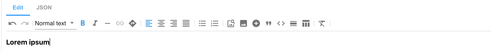
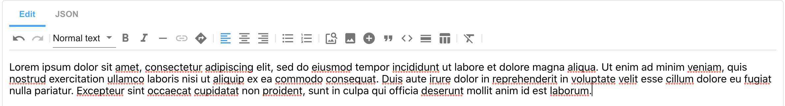
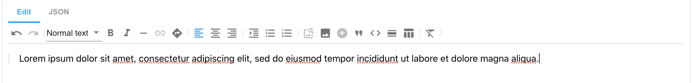

# Rich Text Editor features:

- [Normal Text](#normal-text)
- [Headings 1-6](#headings-1-6)
- [Code Block](#code-block)
- [Custom Styles](#custom-styles)
- [Bold Text](#bold-text)
- [Italic Text](#italic-text)
- [Soft Hyphen](#soft-hyphen)
- [Links](#links)
- [Anchors](#anchors)
- [Align Left](#align-left)
- [Align Center](#align-center)
- [Align Right](#align-right)
- [Align Justify](#align-justify)
- [Bullet List](#bullet-list)
- [Decrease Indentation](#decrease-indentation)
- [Ordered List](#ordered-list)
- [Insert Image from URL](#insert-image-from-url)
- [Quote](#quote)
- [Horizontal Rule](#horizontal-rule)
- [Create Table](#create-table)

Each of these features can be [customized](README.md#configuration) to show or hide, or to reorder the features on the Rich Text Editor's toolbar. The **toolbar item name** should be used for such custom configurations.

Features listed on this page are shown on the default toolbar, unless otherwise specified.

##  Normal Text


### Toolbar item name:
* paragraph

### JSON output:
```json
[
   {
      "type": "markdown",
      "data": "Lorem ipsum dolor sit amet, consectetur adipiscing elit, sed do eiusmod tempor incididunt ut labore et dolore magna aliqua."
   }
]
```

### Markdown output:
```
Lorem ipsum dolor sit amet, consectetur adipiscing elit, sed do eiusmod tempor incididunt ut labore et dolore magna aliqua.
```

## Headings 1-6


### Toolbar item names:
* heading\_1
* heading\_2
* heading\_3
* heading\_4
* heading\_5
* heading\_6

### JSON output:
```json
[
   {
      "type": "markdown",
      "data": "# Heading 1\n\n## Heading 2\n\n### Heading 3\n\n#### Heading 4\n\n##### \\\nHeading 5\n\n###### Heading 6"
   }
]
```

### Markdown output:
```
# Heading 1

## Heading 2

### Heading 3

#### Heading 4

##### Heading 5

###### Heading 6
```

## Code Block 


### Toolbar item name:
* code\_block

### JSON output:
```json
[
   {
      "type": "markdown",
      "data": "```\n<h1 style=\"color:blue;\">A Blue Heading</h1>\n```"
   }
]
```

### Markdown output:
```
   ```<h1 style="color:blue;">A Blue Heading</h1>```
```

## Custom Styles


### JSON output:
```json
[
   {
      "type": "markdown",
      "data": "`<span class=\"red\">Lorem Ipsum</span>`\n\n`<span class=\"green\">Lorem Ipsum</span>`"
   }
]
```

### Markdown output:
```
<span class="red">Lorem Ipsum</span>\
<span class="green">Lorem Ipsum</span>
```

## Bold Text



### Toolbar item name:
* strong

### JSON output:
```json
[
   {
      "type": "markdown",
      "data": "**Lorem ipsum**"
   }
]
```

Markdown output:
```
**Lorem ipsum**
```

## Italic Text


### Toolbar item name:
* em

### JSON output:

```json
[
   {
      "type": "markdown",
      "data": "*Lorem ipsum* "
   }
]
```
### Markdown output:

```
*Lorem ipsum*
```

## Soft Hyphen


### Toolbar item name:
* soft\_hyphen

### JSON output:
```json
[
   {
      "type": "markdown",
      "data": "Lorem&shy;ipsum "
   }
]
```

### Markdown output:
```
Lorem&shy;ipsum
```

## Links


### Toolbar item name:
* link

### JSON output:
```json
[
   {
      "type": "markdown",
      "data": "[Go to http://amplience.com](https://amplience.com/ \"Amplience\")"
   }
]
```

### Markdown output:
```
[go to http://amplience.com](https://amplience.com "Amplience")
```

## Anchors


### Toolbar item name:
* anchor

### JSON output:
```json
[
   {
      "type": "markdown",
      "data": "<a id=\"paragraph-1\"></a>Lorem ipsum dolor sit amet, consectetur adipiscing elit. "
   }
]
```

### Markdown output:
```
<a id="paragraph-1"></a>Lorem ipsum dolor sit amet, consectetur adipiscing elit.
```

## Align Left



### Toolbar item name:
* align\_left

### JSON output:
```json
[
   {
      "type": "markdown",
      "data": "Lorem ipsum dolor sit amet, consectetur adipiscing elit, sed do eiusmod tempor incididunt ut labore et dolore magna aliqua. Ut enim ad minim veniam, quis nostrud exercitation ullamco laboris nisi ut aliquip ex ea commodo consequat. Duis aute irure dolor in reprehenderit in voluptate velit esse cillum dolore eu fugiat nulla pariatur. Excepteur sint occaecat cupidatat non proident, sunt in culpa qui officia deserunt mollit anim id est laborum."
   }
]
```

### Markdown output:
```
Lorem ipsum dolor sit amet, consectetur adipiscing elit, sed do eiusmod tempor incididunt ut labore et dolore magna aliqua. Ut enim ad minim veniam, quis nostrud exercitation ullamco laboris nisi ut aliquip ex ea commodo consequat. Duis aute irure dolor in reprehenderit in voluptate velit esse cillum dolore eu fugiat nulla pariatur. Excepteur sint occaecat cupidatat non proident, sunt in culpa qui officia deserunt mollit anim id est laborum.
```

## Align Center


### Toolbar item name:
* align\_center

### JSON output:
```json
[
   {
      "type": "markdown",
      "data": "<p style=\"text-align: center\">Lorem ipsum dolor sit amet, consectetur adipiscing elit. </p>"
   }
]
```

### Markdown output:
```
<p style="text-align: center">Lorem ipsum dolor sit amet, consectetur adipiscing elit.</p>
```

### Markdown output (`useClasses` set):
```
<p class="amp-align-center">Lorem ipsum dolor sit amet, consectetur adipiscing elit.</p>
```

## Align Right


### Toolbar item name:
* align\_right

### JSON output:
```json
[
   {
      "type": "markdown",
      "data": "<p style=\"text-align: right\">Lorem ipsum dolor sit amet, consectetur adipiscing elit. </p>"
   }
]
```

### Markdown output:
```
<p style="text-align: right">Lorem ipsum dolor sit amet, consectetur adipiscing elit. </p>
```

Markdown output (`useClasses` set):
```
<p class="amp-align-right">Lorem ipsum dolor sit amet, consectetur adipiscing elit.</p>
```

## Align Justify


### Toolbar item name:
* align\_justify

### JSON output:
```json
[
   {
      "type": "markdown",
      "data": "<p style=\"text-align: justify\">Lorem ipsum dolor sit amet, consectetur adipiscing elit, sed do eiusmod tempor incididunt ut labore et dolore magna aliqua. Ut enim ad minim veniam, quis nostrud exercitation ullamco laboris nisi ut aliquip ex ea commodo consequat. Duis aute irure dolor in reprehenderit in voluptate velit esse cillum dolore eu fugiat nulla pariatur. Excepteur sint occaecat cupidatat non proident, sunt in culpa qui officia deserunt mollit anim id est laborum. </p>"
   }
]
```

### Markdown output:
```
<p style="text-align: justify">Lorem ipsum dolor sit amet, consectetur adipiscing elit, sed do eiusmod tempor incididunt ut labore et dolore magna aliqua. Ut enim ad minim veniam, quis nostrud exercitation ullamco laboris nisi ut aliquip ex ea commodo consequat. Duis aute irure dolor in reprehenderit in voluptate velit esse cillum dolore eu fugiat nulla pariatur. Excepteur sint occaecat cupidatat non proident, sunt in culpa qui officia deserunt mollit anim id est laborum.</p>
```

### Markdown output (`useClasses` set):
```
<p class="amp-align-justify">Lorem ipsum dolor sit amet, consectetur adipiscing elit, sed do eiusmod tempor incididunt ut labore et dolore magna aliqua. Ut enim ad minim veniam, quis nostrud exercitation ullamco laboris nisi ut aliquip ex ea commodo consequat. Duis aute irure dolor in reprehenderit in voluptate velit esse cillum dolore eu fugiat nulla pariatur. Excepteur sint occaecat cupidatat non proident, sunt in culpa qui officia deserunt mollit anim id est laborum.</p>
```

## Bullet List


### Toolbar item name:
* bullet\_list

### JSON output:
```json
[
   {
      "type": "markdown",
      "data": "* Lorem ipsum dolor sit amet\n\n* Lorem ipsum dolor sit amet\n\n* Lorem ipsum dolor sit amet\n\n* Lorem ipsum dolor sit amet"
   }
]
```

### Markdown output:
```
* Lorem ipsum dolor sit amet

* Lorem ipsum dolor sit amet

* Lorem ipsum dolor sit amet
```

## Decrease Indentation
* (Displayed only after applying bullet/ordered list)


### Toolbar item name:
* lift

### JSON output:
```json
[
   {
      "type": "markdown",
      "data": "Lorem ipsum dolor sit amet\n\n* Lorem ipsum dolor sit amet\n\n* Lorem ipsum dolor sit amet\n\n* Lorem ipsum dolor sit amet"
   }
]
```

### Markdown output:
```
Lorem ipsum dolor sit amet

* Lorem ipsum dolor sit amet

* Lorem ipsum dolor sit amet

```

## Ordered List


### Toolbar item name:
* ordered\_list

### JSON output:
```json
[
   {
      "type": "markdown",
      "data": "1. Lorem ipsum dolor sit amet\n\n2. Lorem ipsum dolor sit amet\n\n3. Lorem ipsum dolor sit amet\n\n4. Lorem ipsum dolor sit amet"
   }
]
```

### Markdown output:
```
1. Lorem ipsum dolor sit amet

2. Lorem ipsum dolor sit amet

3. Lorem ipsum dolor sit amet
```

## Insert Image from URL


### JSON output:
```json
[
   {
      "type": "markdown",
      "data": ""
   }
]
```

### Markdown output:
```

```

## Quote



### Toolbar item name:
* blockquote

### JSON output:
```json
[
   {
      "type": "markdown",
      "data": "> Lorem ipsum dolor sit amet, consectetur adipiscing elit. "
   }
]
```

### Markdown output:
```
> Lorem ipsum dolor sit amet, consectetur adipiscing elit
```

## Horizontal Rule


### Toolbar item name:
* horizontal\_rule

### JSON output:
```json
[
   {
      "type": "markdown",
      "data": "Lorem ipsum dolor sit amet, consectetur adipiscing elit. \n\n---"
   }
]
```

### Markdown output:
```
---
```

## Create Table
* (on clicking Create Table icon, additional icons are displayed):
    - Add Row
    - Delete Row
    - Add Column
    - Delete Column
    - Delete Table


### Toolbar item names:
* table\_create
* table\_row\_add
* table\_row\_delete
* table\_col\_add
* table\_col\_delete
* table\_delete

### JSON output:
```json
[
   {
      "type": "markdown",
      "data": "| id       | name     | email    |\n|----------|----------|----------|\n| 1        | Ivan     | ivan@amplience.com |\n| 2        | Ian      | ian@amplience.com |"
   }
]
```

### Markdown output:
```
| id       | name     | email    |
|----------|----------|----------|
| 1        | Ivan     | ivan@amplience.com |
| 2        | Ian      | ian@amplience.com |
```