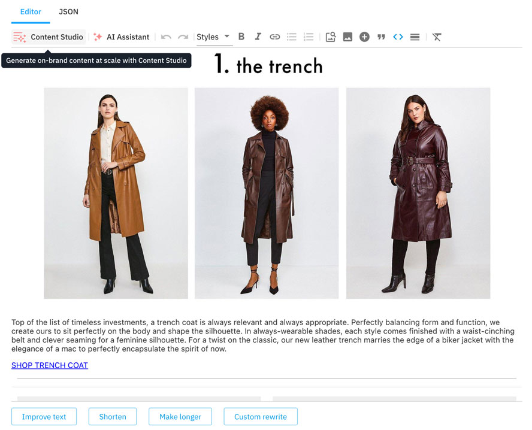
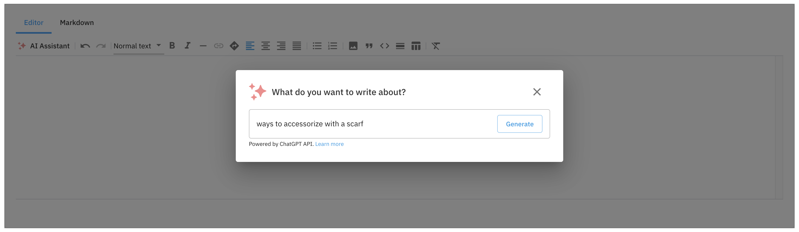

# Generative Rich Text Editor

> Generative Rich text field for use in [Amplience Dynamic Content](https://amplience.com/dynamic-content)

This extension is designed to replace the built in rich text editor with additional features and customization options including generative content from [Amplience Content Studio](#content-studio) and [ChatGPT](https://openai.com/chatgpt) 

## Features

- AI
  - [Content Studio](#content-studio)
  - [Generative AI assistant](#generative-ai-assistant)
- Markdown output
  - Paragraphs
  - Headings
  - Bold text
  - Italic text
  - Soft hyphens
  - Hyperlinks
  - Anchors
  - Text alignment
  - Bullet lists
  - Numeric lists
  - External images
  - Block quotes
  - Code snippets
  - Horizontal rules
  - Inline styles
- JSON output
  - Markdown Blocks
  - Content Blocks
  - Image Blocks
- User friendly editor based on [ProseMirror](https://prosemirror.net/)
  - Cut/copy/paste content
  - Formatting when copying content from other tools
  - Keyboard shortcuts
  - Undo/Redo
- Customizability
  - Enable/disable tools
  - Change toolbar layout
  - Custom styles

More details on the available features can be found on the [Features](FEATURES.md) page, whilst further information on how to configure and customise these features can be found in the [Configuration](#configuration) section.

## How to install

### Register Extension

This extension needs to be [registered](https://amplience.com/docs/development/registeringextensions.html) against a Hub with in the Dynamic Content application (Developer -> Extensions), for it to load within that Hub.


- Category: Content Field
- Label: Rich Text
- Name: dc-extension-rich-text _(needs to be unique with the Hub)_
- URL: [https://rich-text.extensions.content.amplience.net](https://rich-text.extensions.content.amplience.net)
- Description: Rich text editor _(can be left blank, if you wish)_
- Initial height: 500

Note:
You can use our deployed version of this extension (builds from the "production" branch) -

[https://rich-text.extensions.content.amplience.net](https://rich-text.extensions.content.amplience.net)

_As this is an open source project you're welcome to host your own "fork" of this project. You can use any standard static hosting service (Netlify, Amplify, Vercel, etc.) if you wish. Further information can be found on the [Hosting](HOSTING.md) page._

#### Permissions


Sandbox permissions:

- Allow same origin
- Allow pop-ups

### Assign the extension to schema

To use the rich text editor, you simply need to add a field to your content type schema that is configured to use the rich text editor extension.

```json
{
  "type": "string",
  "ui:extension": {
    "url": "https://rich-text.extensions.content.amplience.net",

    "params": {
      "language": "markdown"
    }
  }
}
```

Examples with the Rich Text extension included can also be found within the Extensions section of our [example schemas](https://amplience.com/docs/development/schema-examples/readme.html) in Dynamic Content.

## Installation Params

Using markdown output:

```json
{
  "type": "string",
  "ui:extension": {
    "url": "https://rich-text.extensions.content.amplience.net",

    "params": {
      "language": "markdown"
    }
  }
}
```

The markdown language will output standard [CommonMark](https://commonmark.org/) markdown, e.g.

```markdown
# Heading 1

## Heading 2

Paragraph
```

Using JSON output:

```json
{
  "type": "array",
  "ui:extension": {
    "url": "https://rich-text.extensions.content.amplience.net",

    "params": {
      "language": "json"
    }
  }
}
```

This will output an array of "blocks". Each block has a type and associated data so your application can render the data, e.g.

```json
[
  {
    "type": "markdown",
    "data": "# Ethical Beauty\n\n*10 Organic, Cruelty-Free & Vegan Products to Buy Now*"
  },
  {
    "type": "dc-content-link",
    "data": {
      "id": "e9248f05-ec46-4558-8a18-b6b881597695",
      "contentType": "https://github.com/amplience/dc-accelerators-content-types/blob/master/banner.json",
      "_meta": {
        "schema": "http://bigcontent.io/cms/schema/v1/core#/definitions/content-link"
      }
    }
  },
  {
    "type": "markdown",
    "data": "The ethical beauty market is stronger than ever before. Gone are the days of compromising on a product’s efficacy or luxury in supporting a particular set of values. Here, our Editor talks through some of the best cruelty-free products of the moment."
  }
]
```

## Configuration

You can customize the rich text editor by providing "params" in your content type schema. The examples below should be added to the "params" object in your "ui:extension".

### Content Studio

[Content Studio](https://amplience.com/ai/studios/content-studio/) gives marketers and merchants the power to generate personalized product content that’s on-brand, every time.

Use of Content Studio required you to have access to Content Studio and also Amplience Credits to generate content
Amplience credits provide an easy way to start using our AI features. See [Amplience credits](https://amplience.com/developers/docs/ai-services/credits/)

#### Disabling Content Studio

If for any reason you wish to disable Content Studio from this extension you can do so by adding the following in your installation parameters:

```json
{
  "tools": {
    "contentStudio": {
      "disabled": true
    }
  }
}
```

### Generative AI Assistant

Powered by ChatGPT, the AI Assistant allows users to quickly generate and edit content using natural language prompts.



You can use the Generative AI Assistant with Amplience credits or your own OpenAI account.

By using this feature, you are solely responsible for ensuring that AI generated content complies with internal company policies, applicable laws and [OpenAI's Terms](https://openai.com/policies).

#### Using Amplience credits

Amplience credits provide an easy way to start using our AI features without the need for your own OpenAI account. See [Amplience credits](https://amplience.com/developers/docs/ai-services/credits/)

#### Using your own Open AI account

To get started, you will need to provide your own OpenAI API key which will be used by the extension to communicate with the ChatGPT API. Note, ChatGPT is not affiliated with Amplience and therefore any impact to ChatGPT services such as updates, busy periods, or outages are outside of Amplience control.

To create your key, you first need an OpenAI account which you can create [here](https://platform.openai.com/signup). Once you have an account you can create an API key [here](https://platform.openai.com/account/api-keys).

Once you have your API key, you can enable the AI Assistant feature by adding your API key to the extension parameters as follows:

```json
{
  "tools": {
    "ai": {
      "key": "<OpenAI key>"
    }
  }
}
```

For example:

```json
{
  "properties": {
    "text": {
      "title": "Markdown text",
      "description": "Markdown text",
      "type": "string",
      "minLength": 0,
      "maxLength": 32000,
      "ui:extension": {
        "url": "https://rich-text.extensions.content.amplience.net",
        "params": {
          "tools": {
            "ai": {
              "key": "<OpenAI key>"
            }
          }
        }
      }
    }
  }
}
```

#### Using ChatGPT 4

If you have access to ChatGPT 4 or wish to use a different OpenAI model, you can choose the specific model the system should use as follows:

```json
{
  "tools": {
    "ai": {
      "key": "<OpenAI key>",
      "model": "gpt-4"
    }
  }
}
```

A detailed list of avaliable models can be found [here](https://platform.openai.com/docs/models).

#### Custom edit prompts

When text is selected, preset edit prompts are displayed which save users needing to type out common prompts multiple times. These can be customized to add or remove your preferred prompts.

```json
{
  "tools": {
    "ai": {
      "key": "<OpenAI key>",
      "editPrompts": [
        {
          "label": "Improve this",
          "prompt": "Improve this"
        },
        {
          "label": "Shorten this",
          "prompt": "Shorten this"
        },
        {
          "label": "Elaborate on this",
          "prompt": "Elaborate on this"
        }
      ]
    }
  }
}
```

> Note: If you already have an implementation of this with [Custom Toolbar Layouts](#toolbar-layout) you will need to enable the `ai` button in your toolbar to see the AI assistant button. See below to add the button to your existing layout:

```json
{
  "toolbar": {
    "layout": [{ "type": "button", "toolName": "ai" }]
  }
}
```

#### Using Keywords for SEO

The generative AI assistant can be configured to include SEO keywords in the generated text. Keywords should be defined in a separate field in the schema and the field should be referenced in the installation parameters of the extension using a [JSON pointer](https://datatracker.ietf.org/doc/html/rfc6901) in the `keywordSource` property:

```json
{
  "keywords": {
    "type": "string"
  },
  "content": {
    "type": "string",
    "ui:extension": {
      "name": "rich-text",
      "params": {
        "keywordSource": "/keywords"
      }
    }
  }
}
```

### Disabling the Generative AI Assistant

To Disable the Generative AI Assistant, add the following parameters:

```json
{
  "tools": {
    "ai": {
      "disabled": true
    }
  }
}
```

For example:

```json
{
  "properties": {
    "text": {
      "title": "Markdown text",
      "description": "Markdown text",
      "type": "string",
      "minLength": 0,
      "maxLength": 32000,
      "ui:extension": {
        "url": "https://rich-text.extensions.content.amplience.net",
        "params": {
          "tools": {
            "ai": {
              "disabled": true
            }
          }
        }
      }
    }
  }
}
```

### Enable or disable tools

You can set a whitelist of tools which the user can choose from:

```json
{
  "tools": {
    "whitelist": [
      "undo",
      "redo",
      "strong",
      "em",
      "code",
      "link",
      "lift",
      "bullet_list",
      "ordered_list",
      "image",
      "blockquote",
      "heading",
      "paragraph",
      "code_block",
      "horizontal_rule",
      "clear_formatting",
      "dc-image-link",
      "dc-content-link"
    ]
  }
}
```

You can also blacklist individual tools:

```json
{
  "tools": {
    "blacklist": ["code", "code_block", "inline_styles"]
  }
}
```

### Toolbar layout

The default toolbar layout can be overridden as follows:

```json
{
  "toolbar": {
    "layout": [
      { "type": "button", "toolName": "undo" },
      { "type": "button", "toolName": "redo" },
      {
        "type": "group",
        "children": [
          { "type": "button", "toolName": "strong" },
          { "type": "button", "toolName": "em" }
        ]
      },
      {
        "type": "dropdown",
        "toolNames": [
          "heading_1",
          "heading_2",
          "heading_3",
          "heading_4",
          "heading_5",
          "heading_6"
        ]
      },
      { "type": "button", "toolName": "ai" }
    ]
  }
}
```

You can choose from "button", "dropdown" or "group" when creating your menu.

### Custom CSS

You can modify the default text styles to match your brand styles.

Using inline styles:

```json
{
  "styles": "h1 { color: 'red' }"
}
```

Using an external stylesheet:

```json
{
  "stylesheet": "https://maxcdn.bootstrapcdn.com/bootstrap/3.3.7/css/bootstrap.min.css"
}
```

| WARNING: Custom styles are loaded into the extension and may impact the styling of the UI. You can prefix styles with .ProseMirror to only target the editor area. |
| ------------------------------------------------------------------------------------------------------------------------------------------------------------------ |


### Disable code view

If you want to prevent non-technical users modifying the raw markdown or JSON, you can either hide the code view or make it read only:

```json
{
  "codeView": {
    "disabled": true
  }
}
```

Or

```json
{
  "codeView": {
    "readOnly": true
  }
}
```

### Content Blocks

The JSON version of the editor supports embedding content items. These will appear in the JSON output as a content link and will be published automatically and returned via the content delivery API.


To enable this tool, you must provide a list of content types that the user can choose from.

```json
{
  "tools": {
    "dc-content-link": {
      "contentTypes": ["<schema-id>"]
    }
  }
}
```

By default, an icon will be displayed for embedded content items. You can provide custom icons as follows:

```json
{
  "tools": {
    "dc-content-link": {
      "contentTypes": ["<schema-id>"],
      "contentTypeSettings": [
        {
          "id": "<schema-id>",
          "icon": "<icon-url>"
        }
      ]
    }
  }
}
```

"\*" can be used in place of the schema id to apply the icon to all content types.

If you wish to display a card / visualization, provide a templated URL in the params:

```json
{
  "contentTypeSettings": [
    {
      "id": "<schema-id>",
      "card": "http://myapp.com/visualization?vse={{vse.domain}}&content={{content.sys.id}}"
    }
  ]
}
```

The URL format matches the format used to define cards and visualizations in Dynamic Content.

Finally, you can also provide a custom aspect ratio for each content type.

```json
{
  "contentTypeSettings": [
    {
      "id": "<schema-id>",
      "aspectRatio": "3:1"
    }
  ]
}
```

When using multiple of these properties, use them on the same object:

```json
{
  "contentTypeSettings": [
    {
      "id": "<schema-id>",
      "icon": "<icon-url>",
      "card": "http://myapp.com/visualization?vse={{vse.domain}}&content={{content.sys.id}}",
      "aspectRatio": "3:1"
    }
  ]
}
```

### Experimental: Inline Styles

Inline styles is an experimental feature which lets you provide a list of CSS class names that users can apply to text.


To enable this feature:

1. Create CSS rules for your inline styles within `params`:

```json
{
  "styles": ".was-price { color: red; }"
}
```

2. Within `params.tools`, remove the feature from the blacklist. This feature is blacklisted by default, you can enable it by passing in an empty blacklist.

```json
{
  "blacklist": []
}
```

3. Within `params.tools`, provide settings for each inline style you wish to use.

```json
{
  "inline_styles": {
    "classNames": [
      {
        "className": "was-price",
        "label": "Was Price"
      }
    ]
  }
}
```

4. Within `params`, add your inline styles to the toolbar. Each style must be defined in the `toolNames` array, prefixed with `inline_styles_classname_` and ending with each style's `className` property.

```json
{
  "toolbar": {
    "layout": [
      {
        "type": "dropdown",
        "label": "Styles",
        "toolNames": ["inline_styles_className_was-price"]
      },
      {
        "type": "button",
        "toolName": "clear_formatting"
      }
    ]
  }
}
```

#### Example

An example of configured parameters for inline styles combining each the previous steps can be seen below:

```json
{
  "rich-text": {
    "type": "string",
    "ui:extension": {
      "url": "https://rich-text.extensions.content.amplience.net",
      "params": {
        "tools": {
          "blacklist": [],
          "inline_styles": {
            "classNames": [
              {
                "className": "was-price",
                "label": "Was Price"
              }
            ]
          }
        },
        "toolbar": {
          "layout": [
            {
              "type": "dropdown",
              "label": "Styles",
              "toolNames": ["inline_styles_className_was-price"]
            },
            {
              "type": "button",
              "toolName": "clear_formatting"
            }
          ]
        }
      }
    }
  }
}
```

## How to run locally

- `yarn install`
- `yarn build`
- `cd packages/extension`
- `yarn start`
- Head to `http://localhost:3000` for the locally running extension
