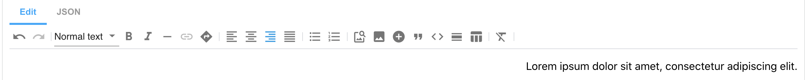
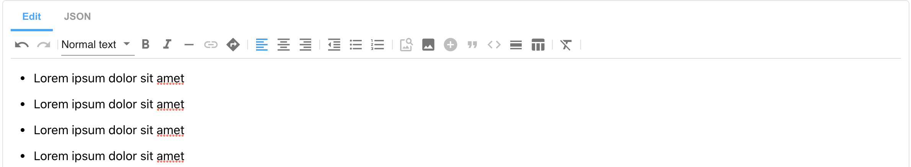
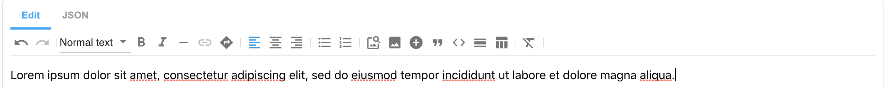

# Rich Text Editor features:

1. Normal Text


```json
[
   {
      "type": "markdown",
      "data": "Normal Text"
   }
]
```

2. Headings 1-5


```json
[
   {
      "type": "markdown",
      "data": "# Heading 1\n\n## Heading 2\n\n### Heading 3\n\n#### Heading 4\n\n##### \\\nHeading 5\n\n###### Heading 6"
   }
]
```

3. Code Block 


```json
[
   {
      "type": "markdown",
      "data": "```\n[\n   {\n      \"type\": \"markdown\",\n      \"data\": \"# Heading 1\"\n   }\n]\n```"
   }
]
```

4. Bold Text 


```json
[
   {
      "type": "markdown",
      "data": "**Lorem ipsum** dolor sit amet, consectetur adipiscing elit, sed do eiusmod tempor incididunt ut labore et dolore magna aliqua. Ut enim ad minim veniam, quis nostrud exercitation ullamco laboris nisi ut aliquip ex ea commodo consequat. Duis aute irure dolor in reprehenderit in voluptate velit esse cillum dolore eu fugiat nulla pariatur. Excepteur sint occaecat cupidatat non proident, sunt in culpa qui officia deserunt mollit anim id est laborum."
   }
]

```
5. Italic Text


```json
[
   {
      "type": "markdown",
      "data": "*Lorem ipsum* "
   }
]

```
6. Soft Hyphen


```json
[
   {
      "type": "markdown",
      "data": "Lorem&shy;ipsum "
   }
]

```
7. Links


```json
[
   {
      "type": "markdown",
      "data": "[Go to http://amplience.com](https://amplience.com/ \"Amplience\")"
   }
]

```
8. Anchors


```json
[
   {
      "type": "markdown",
      "data": "<a name=\"paragraph-1\"></a>Lorem ipsum dolor sit amet, consectetur adipiscing elit, sed do eiusmod tempor incididunt ut labore et dolore magna aliqua. Ut enim ad minim veniam, quis nostrud exercitation ullamco laboris nisi ut aliquip ex ea commodo consequat. Duis aute irure dolor in reprehenderit in voluptate velit esse cillum dolore eu fugiat nulla pariatur. Excepteur sint occaecat cupidatat non proident, sunt in culpa qui officia deserunt mollit anim id est laborum."
   }
]

```
9. Align Left


```json
[
   {
      "type": "markdown",
      "data": "Lorem ipsum dolor sit amet, consectetur adipiscing elit, sed do eiusmod tempor incididunt ut labore et dolore magna aliqua. Ut enim ad minim veniam, quis nostrud exercitation ullamco laboris nisi ut aliquip ex ea commodo consequat. Duis aute irure dolor in reprehenderit in voluptate velit esse cillum dolore eu fugiat nulla pariatur. Excepteur sint occaecat cupidatat non proident, sunt in culpa qui officia deserunt mollit anim id est laborum."
   }
]

```
10. Align Center


```json
[
   {
      "type": "markdown",
      "data": "<p align=\"center\">Lorem ipsum dolor sit amet, consectetur adipiscing elit, sed do eiusmod tempor incididunt ut labore et dolore magna aliqua. Ut enim ad minim veniam, quis nostrud exercitation ullamco laboris nisi ut aliquip ex ea commodo consequat. Duis aute irure dolor in reprehenderit in voluptate velit esse cillum dolore eu fugiat nulla pariatur. Excepteur sint occaecat cupidatat non proident, sunt in culpa qui officia deserunt mollit anim id est laborum.</p>"
   }
]

```
11. Align Right


```json
[
   {
      "type": "markdown",
      "data": "<p align=\"right\">Lorem ipsum dolor sit amet, consectetur adipiscing elit, sed do eiusmod tempor incididunt ut labore et dolore magna aliqua. Ut enim ad minim veniam, quis nostrud exercitation ullamco laboris nisi ut aliquip ex ea commodo consequat. Duis aute irure dolor in reprehenderit in voluptate velit esse cillum dolore eu fugiat nulla pariatur. Excepteur sint occaecat cupidatat non proident, sunt in culpa qui officia deserunt mollit anim id est laborum.</p>"
   }
]

```
12. Bullet List


```json
[
   {
      "type": "markdown",
      "data": "* Lorem ipsum dolor sit amet\n\n* Lorem ipsum dolor sit amet\n\n* Lorem ipsum dolor sit amet\n\n* Lorem ipsum dolor sit amet"
   }
]

```
13. Decrease Indentation (appears only after applied bullet/ordered list)


```json
[
   {
      "type": "markdown",
      "data": "Lorem ipsum dolor sit amet\n\n* Lorem ipsum dolor sit amet\n\n* Lorem ipsum dolor sit amet\n\n* Lorem ipsum dolor sit amet"
   }
]

```
14. Ordered List


```json
[
   {
      "type": "markdown",
      "data": "1. Lorem ipsum dolor sit amet\n\n2. Lorem ipsum dolor sit amet\n\n3. Lorem ipsum dolor sit amet\n\n4. Lorem ipsum dolor sit amet"
   }
]

```
15. Insert Image


```json
[
   {
      "type": "dc-image-link",
      "data": {
         "_meta": {
            "schema": "http://bigcontent.io/cms/schema/v1/core#/definitions/image-link"
         },
         "id": "47384164-dfa0-4164-8220-afbcbbc5d608",
         "name": "yellowbricks",
         "endpoint": "csdemo",
         "defaultHost": "i1.adis.ws"
      }
   }
]

``` 
16. Insert Image from URL


```json
[
   {
      "type": "markdown",
      "data": ""
   }
]

```
17. Insert Content


```json
[
   {
      "type": "dc-content-link",
      "data": {
         "id": "3043683c-480b-453d-9cb5-5dece54508fc",
         "contentType": "https://dev-solutions.s3.amazonaws.com/DynamicContentTypes/Accelerators/banner.json",
         "_meta": {
            "schema": "http://bigcontent.io/cms/schema/v1/core#/definitions/content-link"
         }
      }
   }
]

```
18. Quote


```json
[
   {
      "type": "markdown",
      "data": "> Lorem ipsum dolor sit amet, consectetur adipiscing elit, sed do eiusmod tempor incididunt ut labore et dolore magna aliqua. "
   }
]

```
19. Horizontal Rule


```json
[
   {
      "type": "markdown",
      "data": "Lorem ipsum dolor sit amet, consectetur adipiscing elit, sed do eiusmod tempor incididunt ut labore et dolore magna aliqua. \n\n---"
   }
]

```
20. Create Table (on clicling Create Table icon, additional icons are appeared):
    - Add Row
    - Delete Row
    - Add Column
    - Delete Column
    - Delete Table


```json
[
   {
      "type": "markdown",
      "data": "| id       | name     | email    |\n|----------|----------|----------|\n| 1        | Ivan     | ivan@amplience.com |\n| 2        | Ian      | ian@amplience.com |"
   }
]

```
21. Clear Formatting 


```json
[
   {
      "type": "markdown",
      "data": "Lorem ipsum dolor sit amet, consectetur adipiscing elit, sed do eiusmod tempor incididunt ut labore et dolore magna aliqua."
   }
]

```