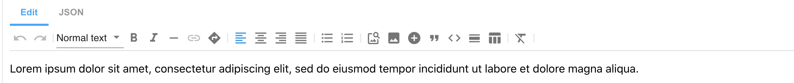
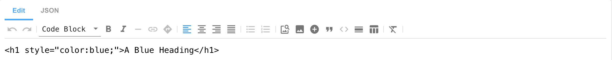
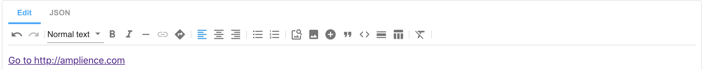
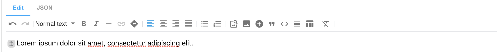
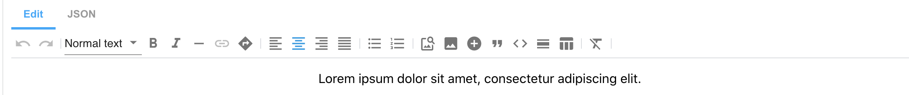
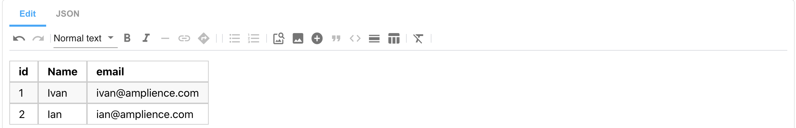

# Rich Text Editor features:

1. Normal Text



JSON output:
```json
[
   {
      "type": "markdown",
      "data": "Lorem ipsum dolor sit amet, consectetur adipiscing elit, sed do eiusmod tempor incididunt ut labore et dolore magna aliqua."
   }
]
```

Markdown output:
```
Lorem ipsum dolor sit amet, consectetur adipiscing elit, sed do eiusmod tempor incididunt ut labore et dolore magna aliqua.
```

2. Headings 1-6


JSON output:
```json
[
   {
      "type": "markdown",
      "data": "# Heading 1\n\n## Heading 2\n\n### Heading 3\n\n#### Heading 4\n\n##### \\\nHeading 5\n\n###### Heading 6"
   }
]
```

Markdown output:
```
# Heading 1

## Heading 2

### Heading 3

#### Heading 4

##### Heading 5

###### Heading 6
```

3. Code Block 



JSON output:
```json
[
   {
      "type": "markdown",
      "data": "```\n<h1 style=\"color:blue;\">A Blue Heading</h1>\n```"
   }
]
```

Markdown output:
```
   ```<h1 style="color:blue;">A Blue Heading</h1>```
```

4. Custom Styles


JSON output:
```json
[
   {
      "type": "markdown",
      "data": "`<span class=\"red\">Lorem Ipsum</span>`\n\n`<span class=\"green\">Lorem Ipsum</span>`"
   }
]
```

Markdown output:
```
<span class="red">Lorem Ipsum</span>\
<span class="green">Lorem Ipsum</span>
```

5. Bold Text 


JSON output:
```json
[
   {
      "type": "markdown",
      "data": "**Lorem ipsum**"
   }
]
```

Markdown output:
```
**Lorem ipsum**
```

6. Italic Text


JSON output:

```json
[
   {
      "type": "markdown",
      "data": "*Lorem ipsum* "
   }
]
```
Markdown output:

```
*Lorem ipsum*
```

7. Soft Hyphen


JSON output:
```json
[
   {
      "type": "markdown",
      "data": "Lorem&shy;ipsum "
   }
]
```

Markdown output:
```
Lorem&shy;ipsum
```

8. Links



JSON output:
```json
[
   {
      "type": "markdown",
      "data": "[Go to http://amplience.com](https://amplience.com/ \"Amplience\")"
   }
]
```

Markdown output:
```
[go to http://amplience.com](https://amplience.com "Amplience")
```

9. Anchors



JSON output:
```json
[
   {
      "type": "markdown",
      "data": "<a id=\"paragraph-1\"></a>Lorem ipsum dolor sit amet, consectetur adipiscing elit. "
   }
]
```

Markdown output:
```
<a id="paragraph-1"></a>Lorem ipsum dolor sit amet, consectetur adipiscing elit.
```

10. Align Left


JSON output:
```json
[
   {
      "type": "markdown",
      "data": "Lorem ipsum dolor sit amet, consectetur adipiscing elit, sed do eiusmod tempor incididunt ut labore et dolore magna aliqua. Ut enim ad minim veniam, quis nostrud exercitation ullamco laboris nisi ut aliquip ex ea commodo consequat. Duis aute irure dolor in reprehenderit in voluptate velit esse cillum dolore eu fugiat nulla pariatur. Excepteur sint occaecat cupidatat non proident, sunt in culpa qui officia deserunt mollit anim id est laborum."
   }
]
```

Markdown output:
```
Lorem ipsum dolor sit amet, consectetur adipiscing elit, sed do eiusmod tempor incididunt ut labore et dolore magna aliqua. Ut enim ad minim veniam, quis nostrud exercitation ullamco laboris nisi ut aliquip ex ea commodo consequat. Duis aute irure dolor in reprehenderit in voluptate velit esse cillum dolore eu fugiat nulla pariatur. Excepteur sint occaecat cupidatat non proident, sunt in culpa qui officia deserunt mollit anim id est laborum.
```

11. Align Center



JSON output:
```json
[
   {
      "type": "markdown",
      "data": "<p style=\"text-align: center\">Lorem ipsum dolor sit amet, consectetur adipiscing elit. </p>"
   }
]
```

Markdown output:
```
<p style="text-align: center">Lorem ipsum dolor sit amet, consectetur adipiscing elit.</p>
```

Markdown output (`useClasses` set):
```
<p class="amp-align-center">Lorem ipsum dolor sit amet, consectetur adipiscing elit.</p>
```

12. Align Right


JSON output:
```json
[
   {
      "type": "markdown",
      "data": "<p style=\"text-align: right\">Lorem ipsum dolor sit amet, consectetur adipiscing elit. </p>"
   }
]
```

Markdown output:
```
<p style="text-align: right">Lorem ipsum dolor sit amet, consectetur adipiscing elit. </p>
```

Markdown output (`useClasses` set):
```
<p class="amp-align-right">Lorem ipsum dolor sit amet, consectetur adipiscing elit.</p>
```

13. Align Justify


JSON output:
```json
[
   {
      "type": "markdown",
      "data": "<p style=\"text-align: justify\">Lorem ipsum dolor sit amet, consectetur adipiscing elit, sed do eiusmod tempor incididunt ut labore et dolore magna aliqua. Ut enim ad minim veniam, quis nostrud exercitation ullamco laboris nisi ut aliquip ex ea commodo consequat. Duis aute irure dolor in reprehenderit in voluptate velit esse cillum dolore eu fugiat nulla pariatur. Excepteur sint occaecat cupidatat non proident, sunt in culpa qui officia deserunt mollit anim id est laborum. </p>"
   }
]
```

Markdown output:
```
<p style="text-align: justify">Lorem ipsum dolor sit amet, consectetur adipiscing elit, sed do eiusmod tempor incididunt ut labore et dolore magna aliqua. Ut enim ad minim veniam, quis nostrud exercitation ullamco laboris nisi ut aliquip ex ea commodo consequat. Duis aute irure dolor in reprehenderit in voluptate velit esse cillum dolore eu fugiat nulla pariatur. Excepteur sint occaecat cupidatat non proident, sunt in culpa qui officia deserunt mollit anim id est laborum.</p>
```

Markdown output (`useClasses` set):
```
<p class="amp-align-justify">Lorem ipsum dolor sit amet, consectetur adipiscing elit, sed do eiusmod tempor incididunt ut labore et dolore magna aliqua. Ut enim ad minim veniam, quis nostrud exercitation ullamco laboris nisi ut aliquip ex ea commodo consequat. Duis aute irure dolor in reprehenderit in voluptate velit esse cillum dolore eu fugiat nulla pariatur. Excepteur sint occaecat cupidatat non proident, sunt in culpa qui officia deserunt mollit anim id est laborum.</p>
```

14. Bullet List


JSON output:
```json
[
   {
      "type": "markdown",
      "data": "* Lorem ipsum dolor sit amet\n\n* Lorem ipsum dolor sit amet\n\n* Lorem ipsum dolor sit amet\n\n* Lorem ipsum dolor sit amet"
   }
]
```

Markdown output:
```
* Lorem ipsum dolor sit amet

* Lorem ipsum dolor sit amet

* Lorem ipsum dolor sit amet
```

15. Decrease Indentation (appears only after applied bullet/ordered list)


JSON output:
```json
[
   {
      "type": "markdown",
      "data": "Lorem ipsum dolor sit amet\n\n* Lorem ipsum dolor sit amet\n\n* Lorem ipsum dolor sit amet\n\n* Lorem ipsum dolor sit amet"
   }
]
```

Markdown output:
```
Lorem ipsum dolor sit amet

* Lorem ipsum dolor sit amet

* Lorem ipsum dolor sit amet

```

16. Ordered List


JSON output:
```json
[
   {
      "type": "markdown",
      "data": "1. Lorem ipsum dolor sit amet\n\n2. Lorem ipsum dolor sit amet\n\n3. Lorem ipsum dolor sit amet\n\n4. Lorem ipsum dolor sit amet"
   }
]
```

Markdown output:
```
1. Lorem ipsum dolor sit amet

2. Lorem ipsum dolor sit amet

3. Lorem ipsum dolor sit amet
```

17. Insert Image from URL


JSON output:
```json
[
   {
      "type": "markdown",
      "data": ""
   }
]
```

Markdown output:
```

```

18. Quote


JSON output:
```json
[
   {
      "type": "markdown",
      "data": "> Lorem ipsum dolor sit amet, consectetur adipiscing elit. "
   }
]
```

Markdown output:
```
> Lorem ipsum dolor sit amet, consectetur adipiscing elit
```

19. Horizontal Rule


JSON output:
```json
[
   {
      "type": "markdown",
      "data": "Lorem ipsum dolor sit amet, consectetur adipiscing elit. \n\n---"
   }
]
```

Markdown output:
```
---
```

20. Create Table (on clicking Create Table icon, additional icons are appeared):
    - Add Row
    - Delete Row
    - Add Column
    - Delete Column
    - Delete Table



JSON output:
```json
[
   {
      "type": "markdown",
      "data": "| id       | name     | email    |\n|----------|----------|----------|\n| 1        | Ivan     | ivan@amplience.com |\n| 2        | Ian      | ian@amplience.com |"
   }
]
```

Markdown output:
```
| id       | name     | email    |
|----------|----------|----------|
| 1        | Ivan     | ivan@amplience.com |
| 2        | Ian      | ian@amplience.com |
```